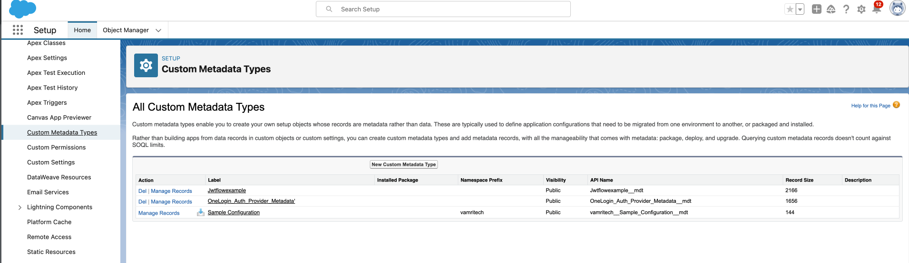
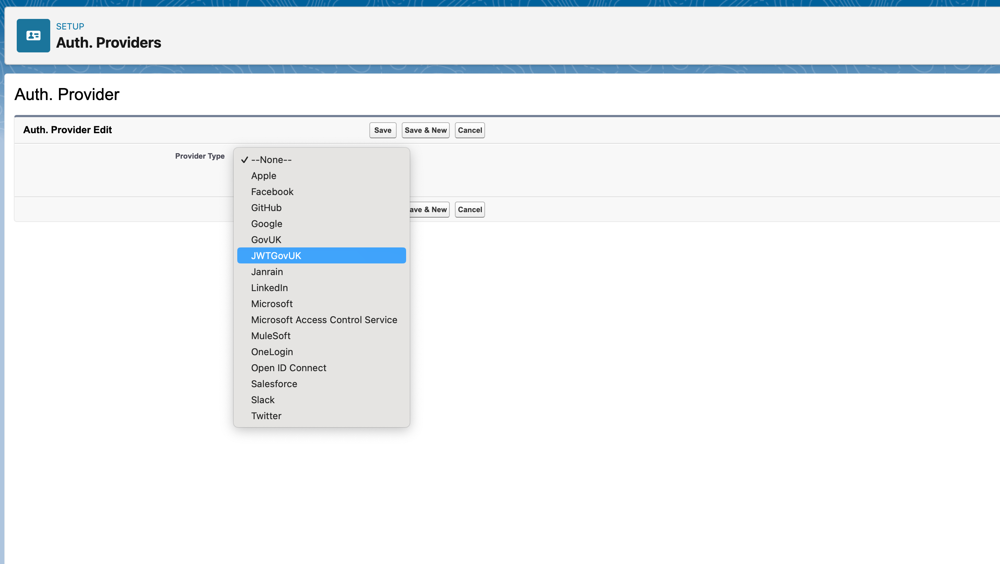
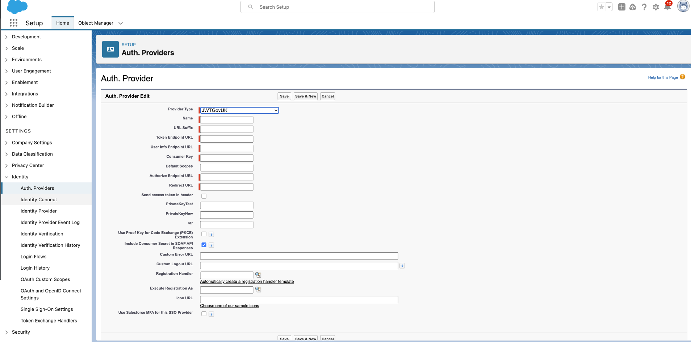

## GOV.UK One Login Relying Party Application

This is a SalesForce application using GOV.UK One Login to authenticate users. It is intended as a reference and doesn't represent production-quality code.

## Development

To successfully integrate with GOV.UK One Login, the following pre-requisite work are required.

- Create a key pair for the private_key_jwt assertion
- Create Custom Metadata Types for the GOV.UK endpoints required for Apex class auth.AuthenticationPlugin
- Import the provided Apex code into Salesforce

### Generate a Key Pair

You can generate a key pair (a public key and a corresponding private key) using OpenSSL.

You’ll need your private key when:

you’re registering your service to use GOV.UK One Login environments, such as integration or production
you request the token using the private key authentication mechanism on the /token endpoint

Run the following on your command line to generate your key pair:

openssl genpkey -algorithm RSA -out private_key.pem -pkeyopt rsa_keygen_bits:2048

openssl rsa -pubout -in private_key.pem -out public_key.pem

You have now generated your key pair, which will appear on your machine as 2 files:

public_key.pem - this is your public key, which you should share with GOV.UK One Login
private_key.pem - this is your private key, which you should store securely and not share

### Custom Metadata types

Custom metadata is customizable, deployable, packageable, and upgradeable application metadata. First, you create a custom metadata type, which defines the form of the application metadata. Then, you build reusable functionality that determines the behaviour based on metadata of that type.

#### Create Custom Metadata Manually

Create Custom Metadata Types in Salesforce via Custom Code | Custom Metadata Types.

- Authorize Endpoint URL
- Consumer Key
- Default Scopes
- PrivateKey
- Redirect URL
- Send access token in header
- Token Endpoint URL
- User Info Endpoint URL
Refer to the documentation for more information: https://help.salesforce.com/s/articleView?id=sf.custommetadatatypes_overview.htm&type=5

#### Import an existing Custom Metadata types

  Install Custom Metadata Type Data Loader as per instruction here : https://appexchange.salesforce.com/appxListingDetail?listingId=a0N4V00000HrQTdUAN

 **Import the CustomMetaDataType.xls(clients/Apex-SalesForce/CustomMetaDataType.xls) to create and populate the GOV.UK One Login OIDC endpoints and mandatory requirement such as Private Key.

### Import the Apex code into Salesforce

Salesforce provides a development console for debugging and testing code.

- Add the Private_Key_JWT via Custom Code | Apex Classes | New to create a new Apex class.

- Once Added goto Identity | Auth.Prodivers | New and select the JWTGovUK under the Provider Type drop down list.

- The output should look similar to the following image :
- Provide the Redirect URL and public_key.pem file to GOV.UK One Login Team so that your service can be registered.
