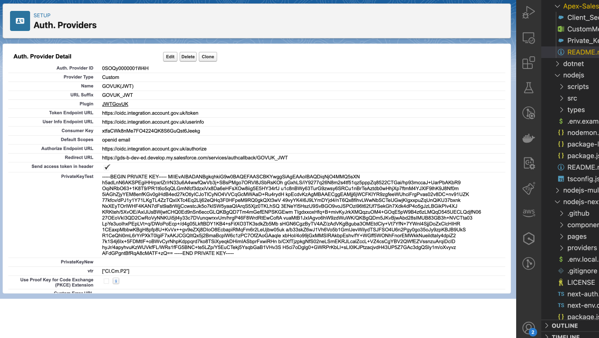

# GOV.UK One Login example Salesforce authentication provider

> This is provided as a reference only and doesn't represent production quality code. It does not contain all the necessary error handing, tests etc that are required by production quality code.

## Overview

 Salesforce applications can be integrated with GOV.UK One Login through the use of the Salesforce [Authentication Provider SSO with Salesforce as the Relying Party](https://help.salesforce.com/s/articleView?id=sf.sso_authentication_providers.htm&type=5).

The GOV.UK One Login example authentication provider for `private_key_jwt` ([`JWTGovUK`]() Apex class) is designed to show how a Salesforce application can use [JSON Web Token (JWT)](https://en.wikipedia.org/wiki/JSON_Web_Token) to authenticate with GOV.UK One Login.

The example authentication provider extends the [`Auth.AuthProviderPluginClass`](https://developer.salesforce.com/docs/atlas.en-us.apexref.meta/apexref/apex_class_Auth_AuthProviderPluginClass.htm).

## Features
- Supports GOV.UK One Login authentication only and identity user journeys
- Supports the `private_key_jwt` token authentication method
- Initiates authentication with GOV.UK One Login [`/authorize`](https://docs.sign-in.service.gov.uk/integrate-with-integration-environment/authenticate-your-user/#make-a-request-to-the-authorize-endpoint)
- Handles callback from GOV.UK One Login
- Retrieves claims from the [`/userinfo`](https://docs.sign-in.service.gov.uk/integrate-with-integration-environment/authenticate-your-user/#retrieve-user-information) endpoint after successful authentication
- **TODO??** Logs out using the`/logout` 

## How to use the example

### Prerequites
- A [registered GOV.UK One Login](https://docs.sign-in.service.gov.uk/before-integrating/set-up-your-service-s-configuration/#register-your-service-to-use-gov-uk-one-login) client ID
- Access to a Salesforce [developer environment](https://developer.salesforce.com/) 

### 1. Register your application as a relying party client with GOV.UK One Login

#### Authentication only journey
For an authentication only journey you can self register using the [self service admin tool](https://admin.sign-in.service.gov.uk/register/enter-email-address). 

#### Identity journey
For an identity journey you must [contact the onboarding team](https://docs.sign-in.service.gov.uk/before-integrating/set-up-your-service-s-configuration/#register-your-service-to-use-gov-uk-one-login) to configure the claims that you require.
 
 On completion of these processes you will have:
- A Client ID
- Your private key
- Your public key
- Access to your requested claims and scopes

### 2. Add the  GOV.UK One Login example authentication provider for `private_key_jwt`

- browse to the [`Private_Key_JWT.cls`](https://raw.githubusercontent.com/govuk-one-login/rp-reference/main/clients/Apex-SalesForce/Private_Key_JWT.cls) class source code and copy to the clipboard
- log into salesforce as a developer at [https://developer.salesforce.com](https://developer.salesforce.com)
- go to "[PLATFORM - TOOLS - Custom Code - Apex Classes](https://gds-c-dev-ed.develop.lightning.force.com/lightning/setup/ApexClasses/home)"
- select the "[New](https://gds-c-dev-ed.develop.lightning.force.com/lightning/setup/ApexClasses/page?address=%2Fsetup%2Fbuild%2FeditApexClass.apexp%3FretURL%3D%252Fsetup%252Fbuild%252FlistApexClass.apexp%26sfdcIFrameOrigin%3Dhttps%253A%252F%252Fgds-c-dev-ed.develop.lightning.force.com%26clc%3D1)" button to add an Apex class and paste in the source code from the clipboard, select the "Save" button.

### 3. Configure a custom metadata type

The configuration parameters for the authentication provider are defined using a [SalesForce Custom MetaData Type](https://help.salesforce.com/s/articleView?id=sf.custommetadatatypes_overview.htm&type=5).

- browse to go to "[PLATFORM - TOOLS - Custom Code - Custom Metadata Types](https://gds-c-dev-ed.develop.lightning.force.com/lightning/setup/CustomMetadata/home)"
- select the "[New Custom Metadata Type](https://gds-c-dev-ed.develop.lightning.force.com/lightning/setup/CustomMetadata/page?address=%2F01I%2Fe%3Fsetupid%3DCustomMetadata%26retURL%3D%252F_ui%252Fplatform%252Fui%252Fschema%252Fwizard%252Fentity%252FCustomMetadataTypeListPage%253FretURL%253D%25252Fsetup%25252Fhome%2526appLayout%253Dsetup%2526tour%253D%2526isdtp%253Dp1%2526sfdcIFrameOrigin%253Dhttps%25253A%25252F%25252Fgds-c-dev-ed.develop.lightning.force.com%2526sfdcIFrameHost%253Dweb%2526nonce%253D2717ed99b68d45fb9cea311a523e7da2aa1aec600fe219c6d7b4f5f4e83ff874%2526ltn_app_id%253D%2526clc%253D1)" button

Ensure that the necessary custom metadata types are set up correctly (`Jwtflowexample__mdt`).
  
|name | type |desc|value|
|-----|------|----|-----|
|`Authorize_Endpoint_URL`| text |URL for authorization endpoint| `https://oidc.integration.account.gov.uk/authorize` |
|`Token_Endpoint_URL` | text | URL for token endpoint| `https://oidc.integration.account.gov.uk/token` |
|`User_Info_Endpoint_URL` | text|  URL for user information endpoint| `https://oidc.integration.account.gov.uk/userinfo` |
|`Default_Scopes` | text| Default scopes required for authentication| `openid email phone` |
|`Redirect_URL` | text |Redirect URL for callback after authentication| {REDIRECT_URI} |
|`Consumer_Key`| text|  Consumer key provided by the authentication provider" ||
|`PrivateKeyTest` | textarea | Private key for signing JWT tokens| |

### 4. Configure the authentication provider

- browse to [Settings - Identity - Auth. providers](https://gds-c-dev-ed.develop.lightning.force.com/lightning/setup/AuthProviders/home)

### 5. Test the integration

   - Use the `initiate` method to initiate the authentication flow.
   - Implement the callback handling logic in the `handleCallback` method.
   - Retrieve user information using the `getUserInfo` method.

## References

### Screenshots

## Custom Exceptions
- `RegPluginException`: Exception thrown for registration plugin errors.
- `CustomException`: Generic custom exception for handling errors.

## Helper Methods
- `generateJWT`: Generates a JWT token for authentication.
- `generateRandomJti`: Generates a random value for the JWT ID (jti).
- `generateNonce`: Generates a random string for nonce.
- `base64UrlEncode`: Encodes Blob data into a base64 URL-safe string.
- `getTokenValueFromResponse`: Extracts token values from HTTP response body.

