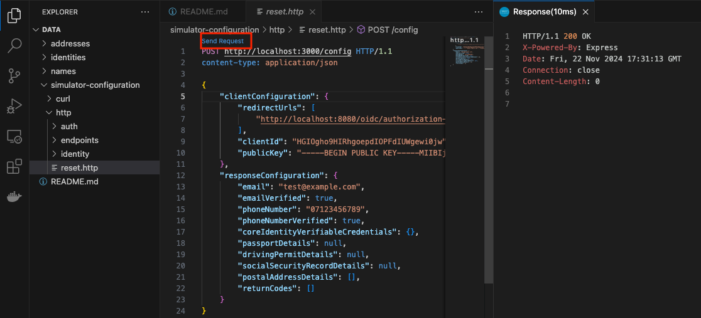

# Example data

Example data to help understanding the formatting of:
- addresses
- names
- identities

It also contains configuration files that can be used to reconfigure the [GOV.UK One Login Simulator](https://github.com/govuk-one-login/simulator)

## Example addresses in JSON format
Some typical examples of addresses

For example:
```
[
  {
    "addressCountry": "GB",
    "uprn": 100023336956,
    "buildingName": "",
    "organisationName": "PRIME MINISTER \u0026 FIRST LORD OF THE TREASURY",
    "streetName": "DOWNING STREET",
    "postalCode": "SW1A 2AA",
    "buildingNumber": "10",
    "addressLocality": "LONDON",
    "validFrom": "1998-01-01",
    "subBuildingName": ""
  }
]
```

all the [example addresses](./addresses)

## Example identities in JSON format
Some typical examples of identities

For example:
```
{
  "type": ["VerifiableCredential", "IdentityCheckCredential"],
  "credentialSubject": {
    "name": [
      {
        "nameParts": [
          {
            "value": "KENNETH",
            "type": "GivenName"
          },
          {
            "value": "DECERQUEIRA",
            "type": "FamilyName"
          }
        ]
      }
    ],
    "birthDate": [
      {
        "value": "1965-07-08"
      }
    ]
  }
}

```

all the [example identities](./identities)

## Example names in JSON format
Some typical examples of names

For example:
```
{
  "type": ["VerifiableCredential", "IdentityCheckCredential"],
  "credentialSubject": {
    "name": [
      {
        "nameParts": [
          {
            "value": "STEPHEN",
            "type": "GivenName"
          },
          {
            "value": "MOORE MBE",
            "type": "FamilyName"
          }
        ]
      }
    ]
  }
}

```

all the [example names](./names)

## Example configuration requests for the GOV.UK One Login Simulator

[simulator-configuration](simulator-configuration)

These are provided in two dialects:
- [curl](https://curl.se/) commands
- [Rest Client](https://marketplace.visualstudio.com/items?itemName=humao.rest-client) visual studio code extension

They both send GET and POST requests to the http://localhost:3000 endpoints


```
└── simulator-configuration
    ├── curl
    │   ├── auth
    │   │   └── errors
    │   ├── endpoints
    │   └── identity
    │       └── errors
    └── http
        ├── auth
        │   └── errors
        ├── endpoints
        └── identity
            └── errors
```

- `endpoints` contains some requests to explore the endpoints
- `auth` contain requests to configure an authentication journey and various error conditions
- `identity`  contain requests to configure an identity journey and various error conditions

### Using the curl command 

Either run in bash

`bash simulator-configuration/cuel/reset.sh`

or source it the files

`source bash simulator-configuration/cuel/reset.sh`

## Using the REST client in Visual Studio Code

Open the http file you require, in this case `reset.http`



- click send request
- review response