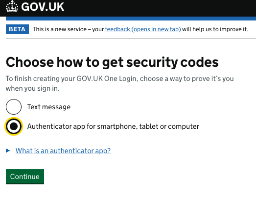
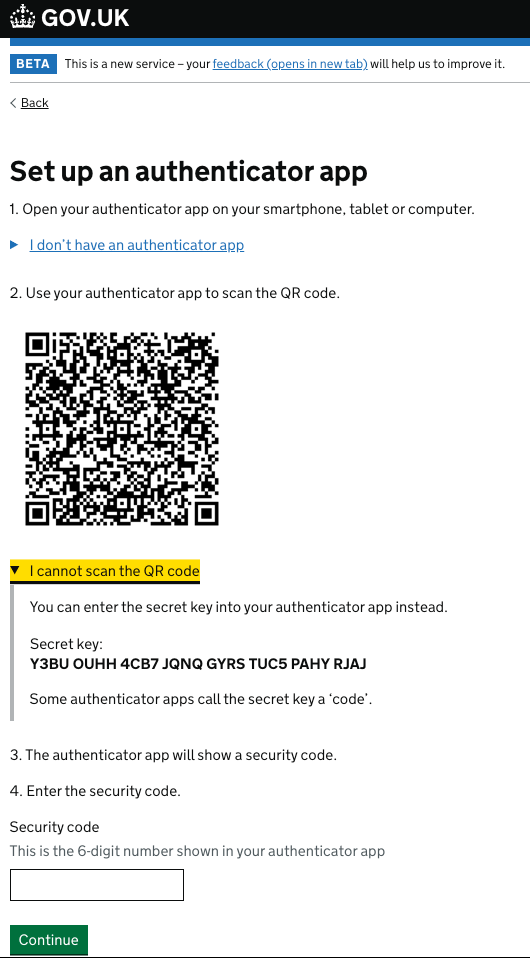

# Generate a Time-based one-time password (TOTP) in TypeScript

A simple command line example that generates a [TOTP](https://en.wikipedia.org/wiki/Time-based_one-time_password) code in TypeScript in accordance with IETF [rfc6238](https://datatracker.ietf.org/doc/html/rfc6238)

## Usage
```
totp.ts

NAME
    totp.ts - generate a TOTP code

SYNOPSIS
    totp.ts SECRET
    
DESCRIPTION
    totp.ts generates a TOTP code using the provided SECRET

EXAMPLES
    totp.ts Y3BUOUHH4CB7JQNQGYRSTUC5PAHYRJAJ
```

## Get the secret key for the authentication app
You need to supply the tool with a secret key to generate the one time codes. 

Follow the GOV.UK One Login journey to register. 



Select "Authenticator app" from the dropdown menu.



Copy the secret key (in this example it is `Y3BU OUHH 4CB7 JQNQ GYRS TUC5 PAHY RJAJ`) and pass it as a parameter to the command line tool `totp.ts`

## Run locally
```
npm install
npx ts-node ./totp.ts Y3BUOUHH4CB7JQNQGYRSTUC5PAHYRJAJ
```
